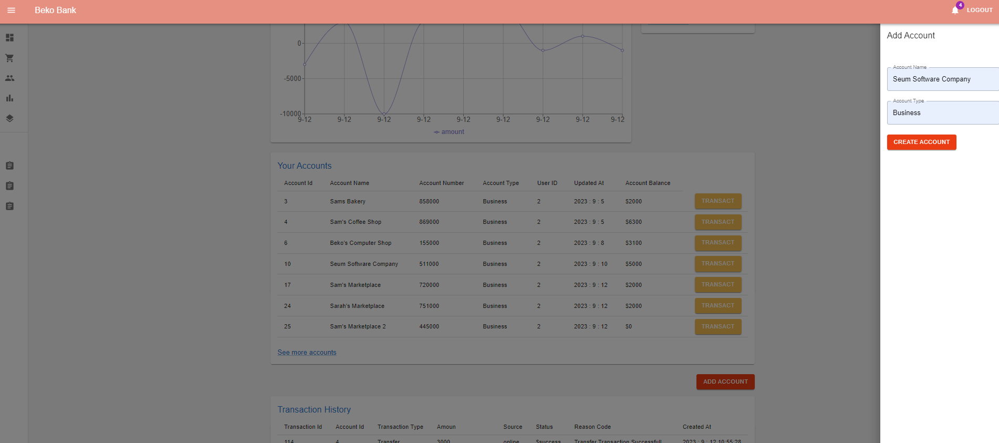

# Online Banking Full Stack Project Frontent Readme File

This is a full-stack project.

The application is a Frontend project prepared for the Online Banking Rest API. React and Redux are used in the frontend of the application. The project is a single-page application, and I have fully leveraged the benefits provided by Redux. Every component you will see in the project is connected to the Redux Store. When the state of one component changes, all components that need to update their state automatically do so, providing users with real-time information.

Users can register, log in, view their account history, open new accounts, make transfers between accounts, deposit money, withdraw money, and make payments. Additionally, a self-updating chart has been prepared for users to view their account flows. In short, the components are constantly in communication with the backend, ensuring seamless interaction.

## Project Images and Components

  
## Features

- React and Redux
- Single Page Application
- Material UI

  
## Technologies

**Language:** Javascript, Java

**Framework:** Spring Boot

**Technologies:** - React, Redux, Router Dom, MySql, Javax Servlet, Tomcat, Spring Security Crypto, Json Web Token, Interceptors

  
